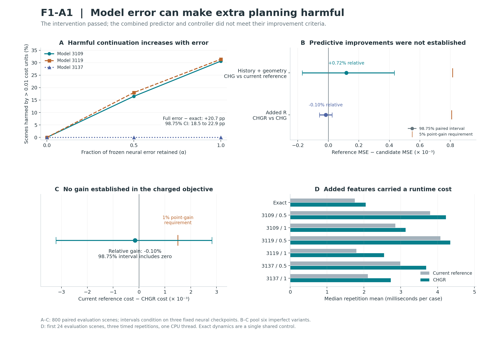

# F1-A1 — Reliability, history and geometry in metacomputation

Research 002 · Saim 13.02  
Experiment: 17 September 2026 · Report: 18 September 2026 · Version 1.0  
Status: completed, audited development study; four prespecified headline outcomes retained.

## Finding

Increasing the error of the planner's transition model caused more harmful extra planning in this controlled toy environment. With full frozen neural error, continuing from planning round 3 to round 6 increased true plan cost by more than 0.01 in **20.67% of scenes on average across the three models**, compared with 0% under exact dynamics. The paired risk difference was **+20.67 percentage points**, with a 98.75% bootstrap interval of **[+18.50, +22.92] points**.

This identifies a project-specific failure mechanism; the tested metacomputation features did not solve it. History plus future geometry reduced prediction MSE by only **0.724%** against its tuning-selected current-based reference. Adding the reliability descriptor slightly worsened MSE, and the combined stop/continue controller slightly worsened the charged decision objective. All three improvement criteria failed. Failure to establish an advantage does not prove equivalence or rule out a different representation, decoder or environment.

The exact-model result has a structural explanation: the planner retains its incumbent, so an exact model cannot choose a strictly worse plan under the same cost function. The empirical contribution is the measured harm and its change under the substituted neural error fields, together with the unsuccessful tests of our proposed predictors. This is not a first discovery of model bias.

## Four headline outcomes

Positive differences favor the claimed effect or candidate. Prediction and decision endpoints equally weight the six imperfect conditions. The error-intervention endpoint averages the three full-error conditions against one shared exact control.

| Question | Observed effect | 98.75% paired interval | Frozen criterion |
| --- | --- | --- | --- |
| Model-error intervention | +20.67 percentage points | [+18.50, +22.92] pp | PASS: ≥5 pp and positive lower bound |
| History + geometry | +0.0001180 MSE; +0.724% relative | [-0.0001708, +0.0004326] MSE | FAIL: required ≥5% and positive lower bound |
| Added reliability descriptor | -0.0000162 MSE; -0.100% relative | [-0.0000584, +0.0000249] MSE | FAIL: required ≥5% and positive lower bound |
| Combined controller | -0.0001552 cost; -0.103% relative | [-0.0032146, +0.0028207] cost | FAIL: required ≥1% and positive lower bound |

Intervals describe **absolute paired differences**, not confidence intervals for the displayed relative percentages. They use 4,000 bootstrap resamples of the same 800 scene IDs jointly across conditions and arms. The 98.75% level allocates a nominal 5% familywise error budget across four headline comparisons by Bonferroni; finite-sample percentile-bootstrap coverage is approximate. All intervals condition on these frozen models, fitted observers and scene distribution. Six imperfect variants are not six independently trained models, and 800 shared scenes are not 5,600 independent evaluation samples.

## What was run

The study reused three previously frozen neural transition models (seeds 3109, 3119, 3137), with **zero neural retraining**. It generated 2,400 fresh scenes from the existing 2D navigation distribution: 1,200 fit, 400 tuning and 800 evaluation scenes. Splits were by complete scene and shared across all conditions. The environment, obstacle penalty, action horizon and planner budget were held fixed.

For true transition f and frozen neural transition fₘ, the intervention was:

`f_(m,α)(x,a) = f(x,a) + α [fₘ(x,a) − f(x,a)]`, with α = 0, 0.5 or 1.

Only one exact condition was run. The half- and full-error conditions retained the same neural error direction at each fixed input; multi-step behavior need not scale linearly because planning changes visited states. Exact and interpolated dynamics are laboratory controls that require simulator access.

The cross-entropy planner used six rounds, 32 candidate ten-action sequences per round, eight elites, and shared candidate noise. The observation checkpoint was round 3. The signed prediction target was:

`V₃ = L_true(U₃) − L_true(U₆)`.

Thus V₃ > 0 means extra planning improves the executed plan, and V₃ < −0.01 defines materially harmful continuation. Negative values were retained. F1-A0 observed round 2; F1-A1's round-3 checkpoint creates two nontrivial history slots, so the two studies' effect sizes are not direct replications.

Sixteen observer inputs were each fitted under seven conditions with a fixed twelve-candidate grid: standardized linear ridge or 128 random Fourier features at two bandwidths, each with four penalties. Tuning MSE selected one pipeline per input/condition: **1,344 candidate fits and 112 selected pipelines**. No additional fitted candidates were added after outcomes. This development design was informed by F1-A0; it is not untouched confirmation. Sealed T1 seeds and P1 reserve families were not used.

## Model error and harmful continuation

| Model / α | One-step RMSE¹ | Ten-step rollout RMSE² | Harmful continuation | Mean true benefit V₃ |
| --- | --- | --- | --- | --- |
| Exact | 0.000000 | 0.000000 | 0.000% | 0.014878 |
| 3109 / 0.5 | 0.015097 | 0.116849 | 16.500% | 0.017956 |
| 3109 / 1 | 0.030194 | 0.233018 | 30.625% | 0.017592 |
| 3119 / 0.5 | 0.015240 | 0.114628 | 18.000% | 0.020580 |
| 3119 / 1 | 0.030480 | 0.228565 | 31.375% | 0.011431 |
| 3137 / 0.5 | 0.001409 | 0.006024 | 0.000% | 0.015032 |
| 3137 / 1 | 0.002818 | 0.012051 | 0.000% | 0.015389 |

¹ One-step coordinate RMSE is measured on the independent 2,048-input reliability bank.  
² Ten-step RMSE aggregates predicted positions over all ten steps and both coordinates on 256 disjoint random action sequences; it is not terminal-only error.  
Each harmful-continuation fraction uses all 800 evaluation scenes under an always-continue counterfactual.

The two less accurate models show substantial harm, increasing from 16.5% to 30.625% for model 3109 and from 18.0% to 31.375% for model 3119 as retained error increases from half to full. Model 3137 has no observed harm above the fixed threshold at either level; this does not prove zero risk in a larger population. Average true benefit remains positive in every condition, so extra planning can help on average while harming a sizeable minority of scenes.

The experiment supports a causal statement about changing these particular transition-error fields while fixing the simulator, scenes, objective and planner randomness. It does not identify a universal relationship between scalar neural-model error and planning harm across architectures or environments.

## The three angles and reliability

| Symbol | Measured quantity | Width |
| --- | --- | --- |
| C | Current scene context; planner means, standard deviations and incumbent actions; sorted candidate costs and incumbent cost | 100 |
| H | C snapshots from rounds 1 and 2 | 200 |
| G | Twelve geometric summaries of the cached imagined paths at round 3 | 12 |
| R | Mean/max local validation error, neighbor-support distance, and global bank RMSE | 4 |
| Raw | Positions from all 32 round-3 candidate trajectories, including their initial positions | 704 |

G describes path length, turns, distance to the goal, obstacle clearance, endpoint dispersion and path efficiency. It is Euclidean geometry of physical rollouts; there is no learned latent manifold or flow-matching component here.

R queries the 16 nearest calibration inputs along the incumbent's predicted path, using scaled positions and actions. It is an error-and-support descriptor, not a calibrated probability of failure. It never observes evaluation-plan true errors when making a decision. Its global RMSE coordinate is constant within each separately fitted condition, so that coordinate cannot explain within-condition differences; the remaining coordinates vary by case.

H and G operationalize past computational history and imagined future structure; C operationalizes a current computational observation. They do not measure subjective awareness. C already carries the planner state needed for its next-round updates. Additional transformations or history might improve a restricted finite-data readout, but they need not contain information beyond a complete current computational state and fixed world model.

### Prediction results

Pooled MSE equally weights the six imperfect variants; lower is better. All inputs receive twelve candidates. C-expanded adds 212 fixed cosine coordinates to C; CR-expanded does the same for CR. Their widths match CHG and CHGR, respectively, without a claim that width exactly matches effective capacity.

| Observer input | Input width | Pooled evaluation MSE |
| --- | --- | --- |
| C | 100 | 0.01609189 |
| CH | 300 | 0.01622349 |
| CG | 112 | 0.01694927 |
| CHG | 312 | 0.01618283 |
| CR | 104 | 0.01609307 |
| CHR | 304 | 0.01633162 |
| CGR | 116 | 0.01609471 |
| CHGR | 316 | 0.01619900 |
| C-expanded | 312 | 0.01620793 |
| CR-expanded | 316 | 0.01632006 |
| C-raw | 804 | 0.01631770 |
| CR-raw | 808 | 0.01599732 |
| C-mismatched-H-G | 312 | 0.01637931 |
| C-H-mismatched-G | 312 | 0.01623643 |
| C-shuffled-H-G | 312 | 0.01622793 |
| C-H-G-mismatched-R | 316 | 0.01628507 |
| Fit-mean constant | 0 | 0.01648372 |

The primary no-R reference is selected **on tuning scenes**, separately per condition, among C, C-expanded and C-raw. Its pooled evaluation MSE is 0.01630087. A selected reference can perform worse on evaluation scenes than an unselected alternative; plain C and CR-raw both have lower pooled evaluation MSE than CHG in this table. We do not choose a new reference using those evaluation results.

| Model / α | No-R reference | Reference MSE | CHG MSE | CHGR MSE | Constant MSE |
| --- | --- | --- | --- | --- | --- |
| Exact | C | 0.00022181 | 0.00025358 | 0.00025332 | 0.00069719 |
| 3109 / 0.5 | C-raw | 0.00686701 | 0.00686757 | 0.00699117 | 0.00736962 |
| 3109 / 1 | C-raw | 0.04065573 | 0.04030271 | 0.04027843 | 0.03999926 |
| 3119 / 0.5 | C-raw | 0.00727654 | 0.00692079 | 0.00692052 | 0.00731518 |
| 3119 / 1 | C-raw | 0.04256157 | 0.04251618 | 0.04251630 | 0.04271281 |
| 3137 / 0.5 | C | 0.00021562 | 0.00024693 | 0.00024742 | 0.00071644 |
| 3137 / 1 | C | 0.00022872 | 0.00024278 | 0.00024017 | 0.00078900 |

### Attribution controls

| Comparison (reference vs candidate) | MSE reduction | Descriptive 95% interval |
| --- | --- | --- |
| CH vs CHG | +0.0000407 | [-0.0001399, +0.0002231] |
| CG vs CHG | +0.0007664 | [+0.0003356, +0.0011735] |
| Mismatched H vs CHG | +0.0001965 | [-0.0000785, +0.0004763] |
| Mismatched G vs CHG | +0.0000536 | [-0.0000345, +0.0001390] |
| Shuffled H vs CHG | +0.0000451 | [-0.0000992, +0.0001929] |
| Mismatched R vs CHGR | +0.0000861 | [-0.0000501, +0.0002322] |
| Strong R reference vs CHGR | +0.0000750 | [-0.0001562, +0.0003220] |

Mismatch mappings were strict within-split derangements: no scene retained its own swapped H, G or R. The H-shuffle independently swapped the two past slots in roughly half of scenes. Some chronology may remain inferable from values, so this is not a general test of time-order information.

The descriptive CHG advantage over CG has a positive interval. The comparisons against CH, mismatched H, mismatched G and the stronger reference do not jointly support the attribution criteria. Accordingly, the weaker CG comparison does not establish that both history and geometry independently contribute useful information. Correctly paired R did not pass its mismatch comparison either.

## Stop/continue decisions and actual computation cost

At round 3, a controller continues to round 6 if and only if its predicted V₃ exceeds 0.01. Its charged objective is true executed-plan cost plus 0.01 for continuation. The common three-round prefix is omitted from this proxy objective. The continuation charge represents three additional planning rounds (960 transition predictions), but excludes feature extraction and readout work; it is not a full runtime cost or an externally supplied economic utility.

The current-based controller was selected by tuning charged objective among C, CR, C-expanded, CR-expanded, C-raw and CR-raw, using each arm's MSE-selected predictor. It may differ from the reference chosen for prediction MSE.

| Model / α | Current controller | CHGR charged cost | Reference charged cost | CHGR continue | Reference continue |
| --- | --- | --- | --- | --- | --- |
| Exact | CR | 0.043211 | 0.043223 | 44.62% | 44.62% |
| 3109 / 0.5 | CR | 0.108359 | 0.108637 | 60.25% | 59.38% |
| 3109 / 1 | C-raw | 0.301469 | 0.303190 | 50.38% | 49.12% |
| 3119 / 0.5 | C | 0.107614 | 0.107817 | 89.25% | 100.00% |
| 3119 / 1 | C-raw | 0.298317 | 0.295429 | 39.62% | 48.38% |
| 3137 / 0.5 | CR | 0.043485 | 0.043346 | 44.12% | 45.38% |
| 3137 / 1 | C | 0.043963 | 0.043857 | 44.38% | 46.62% |

Across imperfect conditions, CHGR continues on **54.67%** of cases versus **58.15%** for the reference. Its mean charged cost is **0.150534**, versus **0.150379** for the reference. Fewer continuation decisions did not establish a better tradeoff: the observed relative gain is **−0.103%**, and the adjusted interval includes both improvement and deterioration.

| Model / α | CHGR true cost | Reference true cost | CHGR harmful continuation³ | Reference harmful continuation³ |
| --- | --- | --- | --- | --- |
| Exact | 0.038748 | 0.038760 | 0.000% | 0.000% |
| 3109 / 0.5 | 0.102334 | 0.102699 | 10.250% | 8.500% |
| 3109 / 1 | 0.296431 | 0.298277 | 15.000% | 12.750% |
| 3119 / 0.5 | 0.098689 | 0.097817 | 16.625% | 18.000% |
| 3119 / 1 | 0.294355 | 0.290592 | 11.875% | 13.750% |
| 3137 / 0.5 | 0.039072 | 0.038809 | 0.000% | 0.000% |
| 3137 / 1 | 0.039525 | 0.039194 | 0.000% | 0.000% |

³ Harmful continuation is the fraction of **all** evaluation scenes where the controller actually continues and V₃ < −0.01; it is not the conditional harm rate among continued cases. Pooled uncharged true cost is 0.145068 for CHGR versus 0.144565 for the reference. Pooled executed harmful-continuation fractions are 8.958% and 8.833%, respectively.

The following charged comparators retain the fixed 0.01 charge. The hindsight oracle uses the true counterfactual benefit, is unavailable at decision time, and is only a lower bound for this two-choice task.

| Model / α | Always stop | Always continue | Hindsight oracle |
| --- | --- | --- | --- |
| Exact | 0.051171 | 0.046293 | 0.041909 |
| 3109 / 0.5 | 0.117359 | 0.109403 | 0.093589 |
| 3109 / 1 | 0.309484 | 0.301892 | 0.258468 |
| 3119 / 0.5 | 0.118397 | 0.107817 | 0.093050 |
| 3119 / 1 | 0.304969 | 0.303538 | 0.256120 |
| 3137 / 0.5 | 0.051594 | 0.046561 | 0.042074 |
| 3137 / 1 | 0.052340 | 0.046951 | 0.042397 |

### Prespecified charge sensitivities

| Charge | Reference minus CHGR cost | Descriptive 95% interval | CHGR continue | Reference continue |
| --- | --- | --- | --- | --- |
| 0.0 | -0.0000419 | [-0.0016102, +0.0015890] | 84.50% | 85.62% |
| 0.005 | -0.0000659 | [-0.0018937, +0.0018326] | 74.04% | 74.10% |
| 0.01 | -0.0001552 | [-0.0025390, +0.0021791] | 54.67% | 58.15% |
| 0.02 | +0.0013887 | [-0.0003541, +0.0033065] | 26.92% | 25.23% |
| 0.05 | +0.0006660 | [-0.0004670, +0.0018427] | 6.56% | 5.46% |

Only the fixed threshold and matching charge vary here. Reference identities remain those selected on tuning data at charge 0.01. These descriptive 95% intervals all include zero and cannot replace the failed primary endpoint.

### Runtime benchmark

| Model / α | CHGR ms | Reference ms | Always-stop ms | Always-continue ms |
| --- | --- | --- | --- | --- |
| Exact | 2.048 | 1.754 | 0.917 | 1.838 |
| 3109 / 0.5 | 4.227 | 3.796 | 1.827 | 3.805 |
| 3109 / 1 | 3.134 | 2.856 | 1.562 | 2.836 |
| 3119 / 0.5 | 4.347 | 4.076 | 2.132 | 3.723 |
| 3119 / 1 | 2.547 | 1.796 | 1.241 | 2.756 |
| 3137 / 0.5 | 3.692 | 2.990 | 1.738 | 4.267 |
| 3137 / 1 | 2.731 | 2.109 | 1.225 | 2.366 |

These are medians of three repetition means over the **first 24 evaluation scenes**, using one CPU thread and rotated method order after warm-up. Timing includes actual online planning, collection of required history, geometry/reliability extraction, feature transforms and readout. It excludes parameter loading, one-time calibration-bank construction, outcome scoring and serialization. Online decisions and executed plans exactly match the saved offline counterfactual choices on this panel.

CHGR was slower than its current-based reference in all seven measured conditions. It was faster than always continuing in two of six imperfect conditions, so the frozen all-condition runtime-saving criterion also failed. The small timing panel is descriptive and hardware-specific; it does not justify a universal latency claim.

The one-time bank uses 2,048 shared true transitions and 2,048 model predictions per condition, plus nearest-neighbor indexing. Recorded per-condition prediction/index setup times ranged from 1.56 to 3.41 ms in this simulator. Those timings exclude acquiring the shared observations and are not a real-world data-collection cost.

## Audit and reproducibility

The post-run audit reconstructed **1,344 candidate tuning scores** and **112 selected pipelines** from saved coefficients, without any refitting. Tuning scores, selected evaluation predictions, fit-only normalization and prefix feature replay agreed exactly in this environment. Independent true-dynamics/cost replay over every saved plan differed by at most 4.44e-15; independent headline interval reconstruction differed by at most 4.34e-19.

The first 100 scenes per condition were replayed only through round 3 to verify that C, H, G, R and raw inputs did not require later planning. All split boundaries, mismatch mappings, reference selections, source/checkpoint hashes and recorded online replay checks passed. Audit reconstruction shares some feature/basis functions with the original implementation; it is not a fully independent second implementation of every operation.

Selected penalties: 0.0001: 1, 0.01: 48, 1: 26, 100: 37 pipelines. Thus 37 of 112 selected pipelines reached the upper penalty boundary. Selected bases were 87 linear, 5 Fourier at bandwidth 0.5 and 20 Fourier at bandwidth 2. A future grid extension would constitute a new study; none was added to this one.

The experiment manifest was written at `2026-09-17T05:53:09.166508+00:00` and completion was recorded at `2026-09-17T05:53:52.306222+00:00`. The source, configuration, protocol and prior checkpoint hashes remain unchanged. A residual incomplete `.tmp` write was found during packaging; it is not read by the study or audit and is excluded from the release. The completed numerical archives used for these findings passed reconstruction and archive-integrity checks. No claim is made that the residual temporary file is valid data.

`F1_A1_Study.zip` includes the frozen protocol, source, prior checkpoints with provenance, all observer coefficients and tuning scores, scene splits, counterfactual plans, evaluation predictions, audit, runtime repetitions, this report, the figure, dependency versions and SHA-256 checksums. `README.md` documents audit-only replay and how to reproduce a fresh numerical run without overwriting this record.

## What this changes, and the next bounded question

The project now has a controlled example of **model error changing the value of additional computation**. It does not yet have evidence that combining computational history, current-state evaluation and future geometry produces a better metacomputation controller in this task. F1-A0's negative geometry result remains on record, and this modified development study does not replace it. No incompatible endpoints from the other research branches are pooled into this result.

The next proposed study, **F1-A2**, should separate signal adequacy from decoder limitations before adding another architecture. Its central question would be: *can an estimate of decision-relevant model bias predict when further optimization will worsen the real plan?* General one-step error magnitude may be too weak or misaligned with the cost change; that is a hypothesis arising from this result, not an established explanation.

A useful positive control would expose simulator-derived cost-bias information on a fixed, already available candidate set, clearly labeled as privileged diagnostic information. A deployable counterpart would estimate the same quantity using only fit/calibration data. An oracle that uses U₆ or its true outcome would instead be a hindsight ceiling and could not count as an online feature. Compare those controls with the same strong current-based reference under a newly frozen protocol and fresh scenes. This would test whether a useful signal exists before expanding the model class. F1-A2 is proposed here; it has not been executed or selected after these outcomes.

## Related work and limits

Model exploitation and the tradeoff between model use and model error are established concerns in [Janner et al., *When to Trust Your Model: Model-Based Policy Optimization*](https://arxiv.org/abs/1906.08253). [Yu et al., *MOPO: Model-based Offline Policy Optimization*](https://arxiv.org/abs/2005.13239) studies uncertainty-penalized rewards in offline model-based policy optimization. They motivate the distinction between model accuracy and reliable decisions; F1-A1 is not an implementation or replication of either method.

The evidence is limited to one fully observed deterministic toy world, three fixed neural checkpoints, fresh samples from a development-exposed distribution, one planner and one observation checkpoint. There is no transformer, attention intervention, flow-matching training, partial-observability experiment, consciousness measurement or claim about subjective present-moment awareness. The organizing idea remains testable, while the current tested combination has not demonstrated the intended practical advantage.
