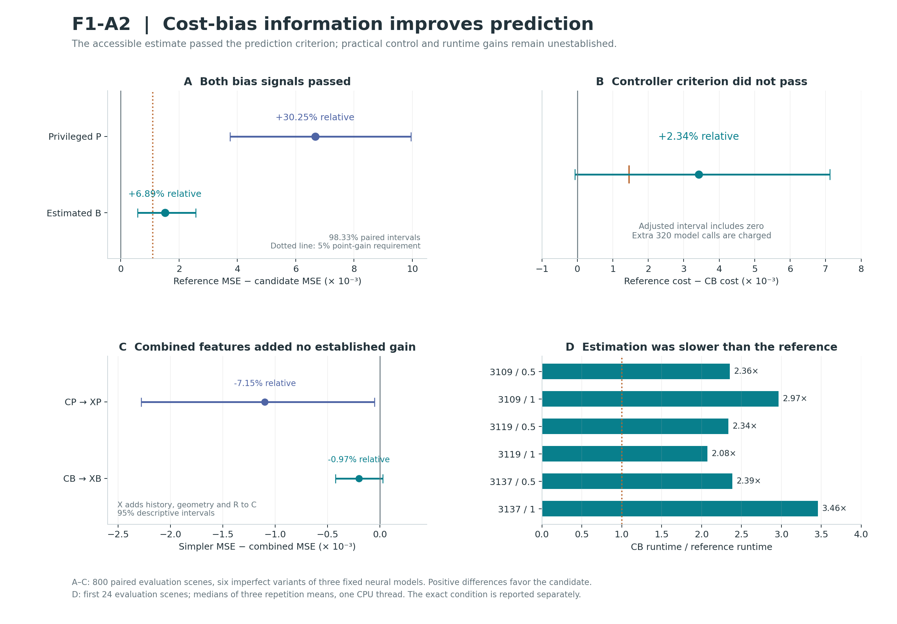

# F1-A2 — Decision-specific model bias and the value of computation

Research 002 · Saim 13.02 · 18 September 2026 · Version 1.0  
Status: completed and audited development study. Two prediction criteria passed; the practical controller criterion did not.

## Finding

**Cost-bias information on the already available candidate plans helped predict whether further planning would improve the real outcome.** A privileged diagnostic using true candidate costs reduced evaluation MSE by **30.25%**, and an accessible estimate based on a separate calibration bank reduced it by **6.89%**, against a tuning-selected reference with access to the previous current/history/geometry/reliability features. Both cleared the frozen 5% prediction threshold and adjusted interval requirement.

The accessible controller's charged objective improved by **2.34%** at the point estimate, but its **98.33% interval included zero**, so the frozen controller criterion failed. Its runtime was **2.08–3.46 times** its reference in the six imperfect conditions. The result supports a useful predictive signal in this setting; it does not yet establish a more efficient metacomputation controller.

Adding the previous history, geometry and magnitude-reliability features to the new estimated signal did not improve the point estimate: XB MSE was **0.97% higher** than CB. The original three-angle synthesis remains unvalidated as a practical improvement. Prediction from decision-specific model bias is the supported advance in this study.

## The mathematical connection

For any action sequence U, define model cost bias as

`b(U) = L_true(U) − L_model(U)`.

The true benefit of continuing planning has the exact decomposition

`V3 = [L_model(U3) − L_model(U6)] − [b(U6) − b(U3)]`.

The first bracket is improvement according to the planner's model. The second is the increase in that model's cost bias. If the bias increases more than the predicted improvement, further optimization makes the real plan worse. This algebra is an identity, not a new theorem or an additional experimental finding.

F1-A2's P and B summaries inspect bias on round-3 candidates as a possible clue to the later bias change. They do **not** observe b(U6) when deciding. G describes physical path geometry; P/B describe cost distortions across candidates. These are different observables. The experiment does not establish that a geometric manifold or subjective awareness is needed.

## Frozen endpoints

Positive differences favor the candidate. Prediction effects are reference MSE minus candidate MSE; the controller effect is reference charged cost minus CB charged cost.

| Endpoint | Relative improvement | Absolute improvement | 98.33% paired interval | Criterion |
| --- | --- | --- | --- | --- |
| Privileged P prediction | +30.250% | +0.0066643 | [+0.0037445, +0.0099481] | PASS |
| Estimated B prediction | +6.887% | +0.0015173 | [+0.0005819, +0.0025657] | PASS |
| Estimated B controller | +2.344% | +0.0034231 | [-0.0000692, +0.0071132] | FAIL |

The reference MSE was **0.02203075**, CP MSE **0.01536641**, and CB MSE **0.02051346**. Both prediction gates required at least 5% relative reduction and a positive adjusted lower bound. The controller gate required at least 1% relative reduction and a positive adjusted lower bound. Its lower bound was **−0.0000692**, so it failed despite a favorable point estimate. The unadjusted 95% controller interval is positive; it cannot replace the prespecified adjusted interval.

The intervals use 4,000 resamples of **800 whole scene IDs**, jointly across all variants and arms. Three headline comparisons use 98.333333% two-sided percentile intervals, a nominal Bonferroni allocation of a 5% familywise budget. Displayed relative percentages are point estimates; the intervals describe absolute paired differences. Bootstrap coverage is approximate. Results condition on three fixed neural checkpoints, fitted readouts and a development-exposed scene distribution. Six imperfect variants are not six independently trained models.

## What was tested

The study used 2,400 fresh scenes, split into 1,200 fit, 400 tuning and 800 evaluation scenes. It retained F1-A1's true 2D dynamics, goal/obstacle/action cost, ten-action horizon, six-round cross-entropy planner, 32 candidates and eight elites. All variants of a scene share the split and planning random draws. The target remains signed V3 = true cost after round 3 minus true cost after round 6.

Seven world-model conditions were retained: one exact simulator and half/full neural error from frozen checkpoints 3109, 3119 and 3137. The primary pool equally weights six imperfect conditions. The exact simulator is diagnostic. There was **zero neural retraining**, and no additional fitted observer after the fixed **1,260 candidate fits and 105 selected pipelines**. F1-A1 informed this development design; F1-A0/F1-A1 results remain intact. No T1 sealed seed or P1 reserve family was used.

### P: privileged diagnostic

At the checkpoint, P uses true-simulator replay of the same 32 candidate action sequences already evaluated by the planner. Twelve summaries capture signed cost bias, its distribution and relation to model cost, elite/rest differences, ranking discordance, and incumbent regret within that candidate set. P uses 320 extra true transition evaluations and is **unavailable to a deployed controller**. It includes true information about the current incumbent cost, which is a component of V3. It never uses later candidates or U6.

### B: accessible estimate

A separate bank of 2,048 state/action observations provides signed one-step transition residuals. At each query, a fixed 16-neighbor weighted affine regression estimates the residual; the model plus that estimated correction rolls out the same 32 cached action sequences. Applying the task cost produces estimated candidate biases, summarized identically to P. No evaluation observation updates the bank. B requires no test-time true transition query beyond the artificial exact/half-error controls embedded in the laboratory model definition. On full neural models, its computation was audited with the true simulator blocked.

B uses signed errors propagated through the cost. R, the earlier reliability descriptor, instead summarizes local error magnitude and calibration support. Both use the same new bank, making the comparison informative about how that data is used. The correction is used only to construct B; it does **not** replace the planner's transition model or choose different U3/U6 plans. This is not value-aware world-model retraining.

## Prediction results and controls

C is the 100-coordinate current planner observation, H contains two past snapshots, G contains twelve physical-path summaries, and R contains four magnitude/support summaries. X = [C,H,G,R]. CP/CB append twelve privileged/estimated bias coordinates to C. XP/XB append them to X. C-expanded adds twelve fixed cosine features and matches CP/CB input width. All fifteen arms receive the same twelve-observer grid, with normalization fit only on fit scenes.

The strong observed reference is selected on tuning MSE separately per condition among C, CR, C-expanded, CR-expanded, C-raw, CR-raw and X. It cannot access P/B. Controller references are selected separately using tuning charged objective. Reference selection is not changed by evaluation results.

| Input | Width | Pooled evaluation MSE |
| --- | --- | --- |
| C | 100 | 0.02219291 |
| CR | 104 | 0.02226704 |
| C-expanded | 112 | 0.02222369 |
| CR-expanded | 116 | 0.02220202 |
| C-raw | 804 | 0.02227681 |
| CR-raw | 808 | 0.02208342 |
| X = CHGR | 316 | 0.02217626 |
| CP (privileged) | 112 | 0.01536641 |
| CB (estimated) | 112 | 0.02051346 |
| XP | 328 | 0.01646509 |
| XB | 328 | 0.02071266 |
| C-mismatched-P | 112 | 0.02221987 |
| C-mismatched-B | 112 | 0.02249737 |
| CP-incumbent | 101 | 0.02019488 |
| CB-incumbent | 101 | 0.02162260 |

Per-condition prediction results retain the exact control and model heterogeneity:

| Model / α | Observed reference | Reference MSE | CP MSE | CB MSE | XB MSE |
| --- | --- | --- | --- | --- | --- |
| Exact | C-expanded | 0.00020729 | 0.00023401 | 0.00023401 | 0.00022733 |
| 3109 / 0.5 | X = CHGR | 0.00885959 | 0.00609119 | 0.00696026 | 0.00753589 |
| 3109 / 1 | C-raw | 0.05391509 | 0.03564417 | 0.05037935 | 0.05043938 |
| 3119 / 0.5 | C-raw | 0.00994503 | 0.00607223 | 0.00791611 | 0.00800966 |
| 3119 / 1 | CR-raw | 0.05893364 | 0.04385249 | 0.05726993 | 0.05773591 |
| 3137 / 0.5 | X = CHGR | 0.00025540 | 0.00025493 | 0.00026094 | 0.00025920 |
| 3137 / 1 | CR-expanded | 0.00027572 | 0.00028345 | 0.00029418 | 0.00029589 |

The gains are concentrated in the two less accurate neural checkpoints. The good checkpoint 3137 does not show a CB improvement in either half/full condition. An aggregate predictive gain is not a universal gain for every model.

### Pairing and incumbent-only controls

| Candidate vs comparator | Relative MSE reduction | Absolute reduction | Descriptive 95% interval |
| --- | --- | --- | --- |
| Correct P vs mismatched P | +30.844% | +0.0068535 | [+0.0044379, +0.0095094] |
| Correct B vs mismatched B | +8.818% | +0.0019839 | [+0.0011635, +0.0028464] |
| Full P vs incumbent P only | +23.909% | +0.0048285 | [+0.0029317, +0.0069892] |
| Full B vs incumbent B only | +5.130% | +0.0011091 | [+0.0007434, +0.0015043] |
| CB vs CR | +7.875% | +0.0017536 | [+0.0009145, +0.0026246] |
| XP vs CP | -7.150% | -0.0010987 | [-0.0022792, -0.0000495] |
| XB vs CB | -0.971% | -0.0001992 | [-0.0004225, +0.0000288] |
| XB vs X | +6.600% | +0.0014636 | [+0.0006243, +0.0023411] |
| CP vs CB | +25.091% | +0.0051471 | [+0.0030042, +0.0075755] |

Both correctly paired P and B beat their within-split mismatched counterparts with positive descriptive intervals. Their full candidate-set summaries also beat their incumbent-only controls: **23.91%** relative for P and **5.13%** for B. Thus the gain is not accounted for by merely exposing the incumbent's cost bias within this tested readout family. These controls support useful candidate-set information; they do not identify a unique causal feature or prove that all twelve coordinates matter.

Adding H/G/R to CP increased MSE by 7.15%, with a negative descriptive 95% improvement interval. Adding them to CB increased MSE by 0.97%, with an interval crossing zero. Adding B to the old X representation did help (6.60% descriptive reduction), but the simpler CB still had the better point estimate. These secondary comparisons do not validate a necessary role for history or physical-path geometry and cannot replace any headline endpoint.

## How accurate was the bias estimate?

| Model / α | Uncorrected rollout RMSE | Corrected rollout RMSE | Zero-bias cost MSE | Estimated-bias cost MSE |
| --- | --- | --- | --- | --- |
| Exact | 0.000000 | 0.000000 | 0.0000000 | 0.0000000 |
| 3109 / 0.5 | 0.113393 | 0.064011 | 0.0781184 | 0.0342733 |
| 3109 / 1 | 0.225933 | 0.128227 | 0.2393238 | 0.1318340 |
| 3119 / 0.5 | 0.110989 | 0.063774 | 0.0794456 | 0.0342489 |
| 3119 / 1 | 0.221091 | 0.127722 | 0.2403055 | 0.1305548 |
| 3137 / 0.5 | 0.006060 | 0.002715 | 0.0004428 | 0.0000798 |
| 3137 / 1 | 0.012125 | 0.005432 | 0.0016894 | 0.0003034 |

Rollout RMSE aggregates positions across all ten steps and both coordinates on a disjoint 256-sequence diagnostic set. Cost-bias MSE uses all 32 cached candidates in each of the 800 evaluation scenes; its zero-bias baseline simply trusts the original model cost. These descriptive errors are not independent candidate-level hypothesis tests. The local correction improves both diagnostics for every imperfect variant, while substantial error remains for checkpoints 3109 and 3119. The larger CP gain therefore leaves room to improve B, but does not uniquely identify whether estimation, summaries or readouts account for the entire gap.

All twelve descriptor-wise RMSE values, incumbent-only bias errors and ranking-discordance errors are retained in `run/result.json`. Exact-condition cost biases and estimation errors are zero, as expected from its zero residual bank.

## Decision outcomes and computation costs

The per-case policy continues iff predicted V3 > 0.01. The primary objective is

`J = true executed-plan cost + 0.01 × continue + feature model-call charge`.

CB/XB add 320 model transitions to estimate B, versus 960 transitions in three additional planning rounds. Their fixed feature charge is 0.00333333 per case. The reference uses cached observations with no extra transition calls. This proxy excludes local regressions, neighbor searches, geometry and readout overhead; actual runtime below includes them. The proxy differs from F1-A1's convention and must not be compared as an identical economic measure across studies.

| Model / α | Controller reference | Reference charged cost | CB charged cost | Reference continue | CB continue |
| --- | --- | --- | --- | --- | --- |
| Exact | X = CHGR | 0.040918 | 0.044414 | 44.25% | 42.12% |
| 3109 / 0.5 | CR-expanded | 0.102912 | 0.098397 | 60.00% | 47.38% |
| 3109 / 1 | C-raw | 0.290334 | 0.281271 | 67.88% | 55.12% |
| 3119 / 0.5 | C-expanded | 0.101961 | 0.100114 | 63.12% | 48.62% |
| 3119 / 1 | X = CHGR | 0.299031 | 0.287293 | 97.25% | 51.12% |
| 3137 / 0.5 | X = CHGR | 0.040730 | 0.044099 | 43.38% | 40.12% |
| 3137 / 1 | C-expanded | 0.041413 | 0.044669 | 41.25% | 41.25% |

Pooled charged cost was **0.142640 for CB** versus **0.146063 for the reference**. CB continued on 47.27% of cases versus 62.15%. Its true executed-plan cost averaged 0.134580 versus 0.139849. Those favorable point estimates do not override the failed adjusted controller gate.

| Model / α | Reference true cost | CB true cost | Reference harmful continuation | CB harmful continuation | All-continuation harm |
| --- | --- | --- | --- | --- | --- |
| Exact | 0.036493 | 0.036868 | 0.000% | 0.000% | 0.000% |
| 3109 / 0.5 | 0.096912 | 0.090326 | 10.750% | 4.875% | 18.000% |
| 3109 / 1 | 0.283547 | 0.272425 | 21.625% | 16.875% | 34.375% |
| 3119 / 0.5 | 0.095648 | 0.091918 | 8.750% | 5.500% | 15.125% |
| 3119 / 1 | 0.289306 | 0.278848 | 31.750% | 14.500% | 32.500% |
| 3137 / 0.5 | 0.036393 | 0.036753 | 0.000% | 0.000% | 0.000% |
| 3137 / 1 | 0.037288 | 0.037210 | 0.000% | 0.000% | 0.125% |

Harmful continuation means the fraction of **all evaluation scenes** where a method continues and V3 < −0.01, not the conditional fraction among continued cases. Pooled rates were 6.958% for CB and 12.146% for the reference. These rates are descriptive; a reduction in harm does not by itself account for foregone beneficial computation or estimation overhead.

Always-stop, always-continue and hindsight bounds at charge 0.01:

| Model / α | Always stop | Always continue | Hindsight oracle |
| --- | --- | --- | --- |
| Exact | 0.047988 | 0.044191 | 0.039884 |
| 3109 / 0.5 | 0.110888 | 0.103827 | 0.086227 |
| 3109 / 1 | 0.292861 | 0.295731 | 0.241531 |
| 3119 / 0.5 | 0.115319 | 0.102811 | 0.088101 |
| 3119 / 1 | 0.295388 | 0.299567 | 0.245240 |
| 3137 / 0.5 | 0.047455 | 0.044041 | 0.039722 |
| 3137 / 1 | 0.048120 | 0.044743 | 0.040191 |

The hindsight oracle observes true V3 and is not implementable at the checkpoint. Privileged CP/XP controller rows are saved only as diagnostics and their displayed charges omit unavailable true-simulator acquisition cost; they are never used to support deployable performance.

### Prespecified charge sensitivities

| Continuation charge | Reference minus CB cost | Descriptive 95% interval | CB continue | Reference continue |
| --- | --- | --- | --- | --- |
| 0.0 | +0.0048657 | [+0.0021901, +0.0076738] | 72.46% | 85.67% |
| 0.005 | +0.0046009 | [+0.0018232, +0.0075177] | 58.90% | 74.85% |
| 0.01 | +0.0034231 | [+0.0004540, +0.0064115] | 47.27% | 62.15% |
| 0.02 | -0.0009578 | [-0.0034261, +0.0015795] | 31.81% | 28.17% |
| 0.05 | -0.0122807 | [-0.0149796, -0.0094564] | 10.00% | 6.94% |

Both the continuation threshold and its charge vary together, and B's model-call charge scales proportionally. Reference identities remain fixed from primary-charge tuning. The results depend on the price assigned to computation: lower charges show favorable descriptive intervals, while the 0.05 charge is unfavorable. These sensitivities do not rescue the failed primary endpoint or establish an externally meaningful optimal charge.

### Actual runtime

| Model / α | Reference ms | CB ms | XB ms | Always-stop ms | Always-continue ms |
| --- | --- | --- | --- | --- | --- |
| Exact | 1.577 | 4.875 | 5.266 | 0.847 | 1.594 |
| 3109 / 0.5 | 2.717 | 6.400 | 6.800 | 1.677 | 3.082 |
| 3109 / 1 | 1.899 | 5.632 | 6.024 | 1.184 | 2.287 |
| 3119 / 0.5 | 2.932 | 6.849 | 6.798 | 1.669 | 3.368 |
| 3119 / 1 | 2.679 | 5.560 | 5.917 | 1.123 | 2.211 |
| 3137 / 0.5 | 2.574 | 6.145 | 6.484 | 1.568 | 3.009 |
| 3137 / 1 | 1.558 | 5.391 | 5.774 | 1.204 | 2.131 |

The benchmark uses the first 24 evaluation scene IDs, one warm-up and three timed repetitions with rotated method order on one CPU thread. Entries are medians of repetition means, in milliseconds per case. They include conditional planning, required history and features, corrected rollouts, neighbor search, local solves and readout; they exclude loading, serialization, true outcome scoring and one-time bank acquisition/index setup. Recorded decisions and plans match offline counterfactual choices exactly.

CB was 2.08–3.46× slower than its observed reference across imperfect conditions and slower than always continuing in every condition. The runtime-saving gate failed. This implementation spends substantial computation to decide whether to spend more. The small benchmark is hardware-specific; the result supports a measured limitation, not a universal latency ratio.

Calibration requires 2,048 shared true transitions plus model residual evaluation and indexing for each condition. Its data acquisition cost is not part of online timing and would require a source of trustworthy observations in a real application.

## Audit and reproducibility

The audit reconstructed all **1,260 tuning scores and 105 selected predictors without refitting**. Tuning scores, selected predictions, fit-only normalizers and 100 prefix-feature replays per condition agreed exactly. An independent physics/cost implementation differed from saved true plan costs by at most **4.44e-15** and candidate costs by **6.66e-15**. Independent headline reconstruction differed by at most **1.73e-18**.

All splits, strict mismatch derangements, tuning reference choices, frozen hashes and online replay checks passed. For all three full neural models, the true simulator was replaced with a failing stub while reconstructing B; the reconstruction succeeded. This verifies that the accessible bias path uses the saved calibration bank and model rather than true simulator calls. Feature/readout replay shares some implementation functions with the experiment; it is not a wholly independent implementation.

Selected ridge penalties were 0.01: 56, 1: 48, 100: 1 pipelines. Selected bases were 95 linear, 4 Fourier at bandwidth 0.5, and 6 Fourier at bandwidth 2. There was no post-result grid extension. Source/configuration/protocol/checkpoint hashes were captured at `2026-09-18T04:42:01.737612+00:00`; the run completed at `2026-09-18T04:43:23.847755+00:00` and the hashes remained unchanged.

The release includes the frozen source and protocol, inherited neural checkpoints and provenance, calibration bank, split IDs, current candidate actions and true/model/corrected costs, U3/U6 plans, all candidate coefficients, selected predictions, runtime repetitions, audit, report, figure, dependency versions and SHA-256 checksums. `README.md` documents audit-only replay and reproduction in a separate directory. No future F1-A3 result is included.

## Implication for metacomputation and the next question

F1-A1 showed that the model can make extra planning harmful; F1-A2 now shows that **decision-specific model bias can help predict the value of further computation** in the same task family. The accessible estimate improved prediction even against controls that included the earlier H/G/R representation. The result does not show that every form of foresight is useful or that combining all three research angles is better.

The next bounded question is whether we can preserve this predictive gain with a cheaper bias estimate. A proposed **F1-A3** could compare the current estimator with a fixed smaller candidate subset or a compact approximation trained on fit/calibration data, using fresh scenes and an explicit online cost budget. Any learned approximation needs separation between its training and downstream selection to avoid leakage. The estimator should be chosen before outcomes; no favorable subset from F1-A2 may become a retrospective success criterion. This is a proposed direction, not an executed study.

## Related work and limits

Task utility rather than accurate state reconstruction alone is an established motivation in [Grimm et al., *The Value Equivalence Principle for Model-Based Reinforcement Learning*](https://arxiv.org/abs/2011.03506). [Voelcker et al., *Value Gradient weighted Model-Based Reinforcement Learning*](https://arxiv.org/abs/2204.01464) studies the mismatch between dynamics prediction losses and decision utility. F1-A2 does not implement their objectives, establish novelty, or validate their broader claims; it tests cost-bias descriptors for one project's metacomputation question.

The evidence remains limited to one fully observed deterministic toy environment, three frozen neural models, one planner/checkpoint, a development-exposed distribution and the stated observer class. Fresh scene sampling does not test new environments or independently retrained models. P is privileged; exact/half-error models require simulator knowledge. No claim concerns consciousness, subjective present-moment awareness, transformers, recursive attention, flow matching or a learned geometric manifold.
