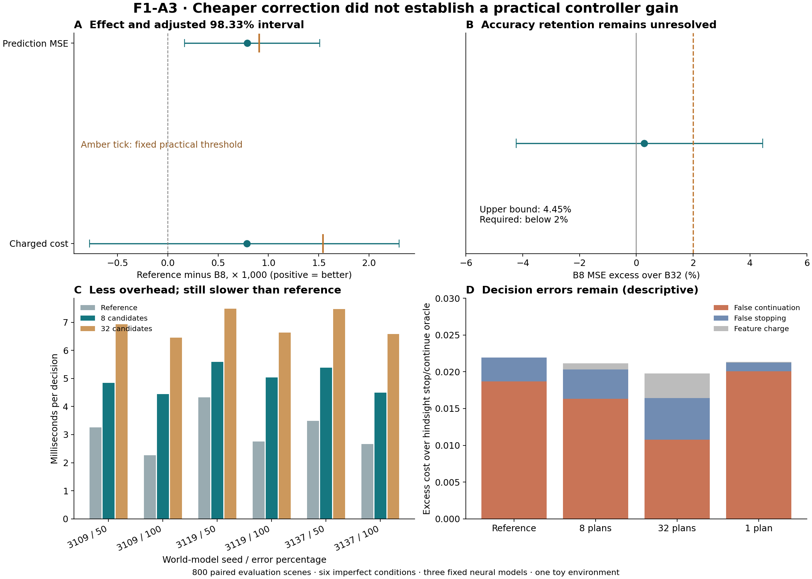

# F1-A3 — Eight-candidate bias estimation

Author: Saim 13.02 · Completed 4 October 2026 · main-v1 · audited development evidence.

**Decision: do not advance B8 as a practical metacontroller.** Evaluating eight candidate plans cuts correction calls by 75% and reduces end-to-end time relative to evaluating 32. A small predictive improvement is detectable, but it misses the predefined practical size. Accuracy noninferiority to 32 candidates is unresolved, and useful cost-adjusted control and runtime savings against the strong reference are not established.

## The question in ordinary language

The planner imagines routes through a small simulated world. Its imagined route costs can be wrong. We asked whether inspecting the errors on eight representative routes is enough to decide whether thinking longer will help. The comparison holds the world models and planner fixed: it changes how much information the stopping predictor buys.

## Fixed design and primary results

2,400 fresh scenes; 1,200 observer-fit, 400 tune and 800 evaluation. One exact and six imperfect world-model conditions share every scene, candidate noise and split. The six imperfect conditions are equally weighted inside each scene; bootstrap resamples scenes, not individual condition-scene rows. There are only three frozen neural model seeds. Results are conditional on those models and this environment.

The primary candidate B8 uses local-linear residual correction at eight current model-cost ranks [0,4,9,13,18,22,27,31], including the incumbent. B32 corrects every candidate. Both add 12 bias descriptors to the same 100 current-state features, use the same 12-candidate predictor grid and choose by tuning MSE. The reference is tuning-selected from seven arms including current candidate paths, nonlinear capacity controls, reliability, history and geometry. Prediction and controller references are selected separately.

| Primary gate | Observed result | Fixed requirement | Verdict |
|---|---|---|---|
| Useful B8 prediction | **4.34%** lower MSE; 0.018190 → 0.017400. Paired improvement adjusted CI: [0.000168, 0.001510]. | At least 5% and positive adjusted lower bound | Practical size missed; small signal supported |
| Retained accuracy versus B32 | B8 MSE **0.27% higher**; adjusted relative-excess CI **[−4.23%, +4.45%]** | Adjusted upper bound below +2% | Inconclusive noninferiority |
| Charged controller | **0.51%** lower charged cost; 0.154207 → 0.153421. Adjusted difference CI **[−0.000778, +0.002301]** | At least 1% and positive adjusted lower bound | Not established |
| Additional runtime gate | B8 is **28.42% faster than B32**, but **1.29–1.96× slower than its reference** | At least 10% faster than B32; faster than reference in every imperfect condition | Failed |

All three efficacy intervals are 98.333% two-sided, correcting for three declared tests. The point estimate is not evidence of noninferiority. Runtime is a separate hardware-specific engineering gate. Its pooled descriptive 95% B8/B32 ratio interval is [0.704, 0.728]; B8/reference is [1.541, 1.635].

## What this changes in our understanding

1. **The computational bottleneck is real.** Shared-prefix online model transitions average 1,595.4 for B8 versus 1,614.6 for the reference, yet B8 takes longer. Neighbor searches, correction and observer work matter; a count of model transitions does not substitute for wall time.
2. **Prediction and useful decisions remain different tests.** B8 reduces false-continuation regret but raises false-stopping regret. The gross policy advantage is then partly consumed by feature cost. Its controller point gain is too small and uncertain to qualify.
3. **The 32-plan signal was weaker on these fresh scenes.** B32's descriptive prediction gain is 4.60%; its paired 95% MSE-gain interval includes zero. This does not erase F1-A2, but limits claims of reliable transfer even within the same distribution and models.
4. **Do not assume that more features improve the controller.** Pair-mismatched B8 loses predictive value (3.84% relative reduction for correctly paired B8; exploratory 95% improvement interval positive). But B8 adds only 0.19% over incumbent-only B1, with an interval crossing zero. Adding history/geometry/reliability to B8 worsens MSE by 1.77% here. These are secondary diagnostics, not independently confirmed mechanisms or grounds to choose a new winner on this evaluation set.

## Per-condition transparency

Positive charged gain favors B8. Reference names are defined in the protocol; the first reference is selected for prediction and the second for control.

| Condition | Prediction / controller reference | B8 MSE | B32 MSE | B8 charged gain | B8/reference runtime |
|---|---|---:|---:|---:|---:|
| m3109_a50 | c / x | 0.010394 | 0.010300 | +2.51% | 1.48× |
| m3109_a100 | crraw / crraw | 0.041724 | 0.040603 | +0.42% | 1.96× |
| m3119_a50 | cr / x | 0.007964 | 0.007831 | +2.53% | 1.29× |
| m3119_a100 | cre / c | 0.043957 | 0.045021 | -0.27% | 1.82× |
| m3137_a50 | ce / x | 0.000171 | 0.000175 | -1.78% | 1.54× |
| m3137_a100 | ce / x | 0.000192 | 0.000188 | -1.39% | 1.68× |

The exact condition is retained in raw records as a diagnostic and excluded from headline tests. Half-error conditions intentionally interpolate with the true simulator and are intervention diagnostics; full-error models are the deployable-style access check.

## Cost and error decomposition

Continuation costs 0.01 for 960 additional state-action transitions. Correction is charged even when stopping: B8 adds 80 transitions, B32 adds 320 and B1 adds 10. Prefix computation is common to charged-objective comparisons but included in measured runtime and total calls. The charge is a toy exchange rate, not measured energy or money.

| Controller | Charged cost | False-continue regret | False-stop regret | Feature charge | Mean total transitions |
|---|---:|---:|---:|---:|---:|
| Reference | 0.154207 | 0.018683 | 0.003263 | 0.000000 | 1614.6 |
| B8 | 0.153421 | 0.016352 | 0.003975 | 0.000833 | 1595.4 |
| B32 | 0.152019 | 0.010741 | 0.005685 | 0.003333 | 1754.2 |
| B1, exploratory | 0.153635 | 0.020072 | 0.001199 | 0.000104 | 1609.0 |

Regret is excess cost over the hindsight optimal stop/continue action at threshold 0.01. It is diagnostic: the controller does not observe hindsight labels. B1 has no measured end-to-end runtime in this protocol, so its lower correction count is not a demonstrated speed win. B32's better charged point estimate cannot be promoted to the primary result after evaluation.

## Verification and reproducibility

- Protocol and code committed before execution: [b549785](https://github.com/saim14/metacomputing001/commit/b549785c9a1552b9c071137b860f1791d1a1eee8).
- All **1,008 tuning scores** and **84 selected pipelines** reconstructed without fitting. Prediction, normalization and subset-feature reconstruction errors are exactly zero.
- Independently reimplemented true costs agree within 6.0e-15. Primary intervals agree within 4.5e-18.
- **5,600 online decision replays** reproduce the selected plan exactly, with zero decision mismatch. Actual model-transition counts are verified.
- Prefix features reconstructed for 100 cases in all seven conditions. True simulator blocked while computing accessible subset corrections for all three full-error neural models. Poisoning future/privileged fields leaves observer inputs unchanged.
- Strict within-split derangements verified; no self-pair or cross-split leakage. Source, protocol, calibration and model hashes stayed fixed.
- Shared scene generation and predictor fitting took 66.6 seconds in the recorded runtime; audit took 6.5 seconds. This excludes original world-model training and inherited calibration generation, which were reused. Timing is not portable across machines.

The repository includes a runnable Colab notebook, frozen dependencies, the full run archive, raw timings, selected predictor states, candidate grids, and audit. Archive restoration verifies hashes and ZIP integrity. Fresh reproductions use a new directory; completed outputs are preserved. The dependency directory deliberately excludes all old planning evaluation outcomes.

The recoverable F1-A3 predecessor was the calibration pilot and draft. Conversation context mentioned a main-run start without recoverable artifacts; this run uses a distinct name and fresh seeds. The executor clock differed from the supplied conversation clock; machine timestamps are retained as system-clock provenance, while the study date follows the user's 4 October context. They are not evidence about elapsed wall time.

## Managed next decision — proposed, not run

**Stop searching candidate-subset sizes on these evaluation scenes.** The next narrow question is whether a predictor trained and selected for stop/continue regret, using only existing current-state features, can beat the same MSE-selected baseline at lower total overhead. B1 is an optional single, predeclared information arm; it has not earned promotion here.

A prospective F1-A4 design should separate two factors: representation (current state versus current plus one-plan bias) and learning objective (MSE regression versus cost-weighted stop/continue decision loss). This identifies whether the next gain comes from buying more information or using existing information better. Fix the four arms, the true-outcome objective, one charge, fit/tune separation, fresh scene seeds and runtime gate before evaluation; leave new model seeds for later confirmation. The four-arm design is proposed only; no extra models were fitted after F1-A3.

The three research angles remain joined by one question: **which information is worth computing before acting?** This run offers no practical advantage for combining history, present summaries and physical-path geometry. It tests one small world-model component, not awareness, general intelligence, or a Transformer-specific mechanism.

Related primary literature: [Sung et al. (2021), Learning When to Quit](https://arxiv.org/abs/2103.04374); [Callaway et al. (2018), Learning to select computations](https://arxiv.org/abs/1711.06892). These supply context for stopping and computational overhead, not evidence that the present implementation is novel or successful.
