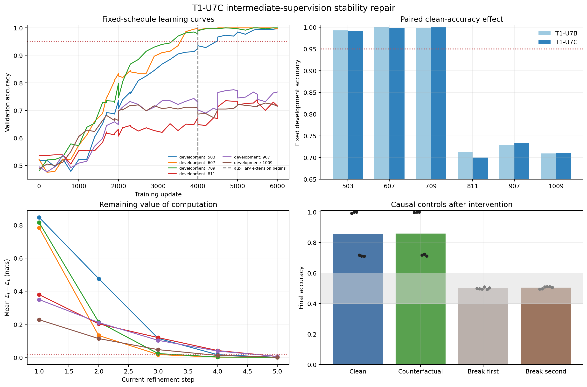

# T1-U7C — Intermediate-supervision training-signal repair

Research lead: Saim 13.02  
Closure date: 5 September 2026  
Protocol: T1-U7C, version 0.11.0  
Status: **Complete; failed the all-development-seed gate (3/6 passed).**

The auxiliary-loss weight of 0.005 during the fixed extension preserved the
three previously passing seeds and rescued none of the three previously
failing seeds. The saved outputs for seeds 907 and 1009 were recovered alongside
the other four complete runs. No training was repeated during closure.

Seeds **1103, 1201, and 1301 remain unopened**. No trajectory probes were fitted.
T1-U8 remains blocked. The current training-repair branch stops here under the
accepted Research 002 direction freeze; its budget for new repair configurations
is zero.

## Question and fixed intervention

Does maintaining mild intermediate supervision during updates 4,001–6,000
repair the exposed T1-U7B failures, while retaining the model, training data
streams, update budget, causal controls, target, and thresholds?

Every seed received the same 6,000-update schedule from initialization, including
the unchanged T1-U7B prefix through update 4,000. The sole **training** change was
the auxiliary-loss weight during the four existing 500-update extension streams:
0.0 in T1-U7B versus 0.005 in T1-U7C. No optimizer reset occurs at stream boundaries.
The logged prefix losses, gradients, and validation metrics match T1-U7B exactly
for all six seeds; this verifies the recorded prefix, not a hash of every
unlogged intermediate optimizer state.

The extension loss is

\[
\mathcal L_{\mathrm{train}}
=\operatorname{CE}_6+0.005\,\frac{1}{5}\sum_{l=1}^{5}\operatorname{CE}_l.
\]

The model retains six weight-tied refinement steps, width 32, two attention
heads, feed-forward width 64, structural embeddings, and residual scale 0.5.
The task retains eight possible keys, five mappings, and a two-hop lookup chain
with balanced binary-value token counts. All six seeds are exposed development
seeds in T1-U7C; none is an untouched confirmation replicate.

## Frozen decision rule

Every development seed must meet every threshold before reserved confirmation
seeds may be opened. Averaging across seeds cannot override a failed seed.

| Measurement | Threshold |
|---|---:|
| Clean final accuracy | At least 0.95 |
| Paired-counterfactual accuracy | At least 0.90 |
| First-edge corrupted accuracy | Within [0.40, 0.60] |
| Second-edge corrupted accuracy | Within [0.40, 0.60] |
| Remaining-computation value | At least two intermediate steps with both mean and sample SD at least 0.02 nats |

Clean accuracy uses 4,000 held-out examples per model. Causal evaluation uses
2,000 matched clean/counterfactual pairs per model. Paired-counterfactual
accuracy requires **both** the clean example and its label-changing
counterfactual to be correct. It is distinct from accuracy on counterfactual
examples alone. The corruption band is a preregistered screening threshold,
not a statistical equivalence test establishing exact chance performance.

## Complete results

| Seed | Clean accuracy | Paired CF | Break edge 1 | Break edge 2 | Valid value steps | Gate |
|---:|---:|---:|---:|---:|---|---|
| 503 | 0.99200 | 0.9875 | 0.4985 | 0.4945 | 1, 2, 3 | Pass |
| 607 | 0.99750 | 0.9975 | 0.4965 | 0.4965 | 1, 2 | Pass |
| 709 | 1.00000 | 0.9980 | 0.4940 | 0.5090 | 1, 2, 3 | Pass |
| 811 | 0.70000 | 0.5830 | 0.5085 | 0.5105 | 1, 2, 3, 4 | Fail |
| 907 | 0.73375 | 0.6135 | 0.4915 | 0.5100 | 1, 2, 3, 4 | Fail |
| 1009 | 0.71100 | 0.6115 | 0.5020 | 0.5050 | 1, 2, 3 | Fail |

Seeds 811/907/1009 fail both performance thresholds. Every seed passes both
edge-corruption checks and the value-availability check. Seed 607 retains only
two eligible value steps, compared with three in T1-U7B, and still meets the
fixed minimum.

Previously passing seeds have mean clean accuracy 0.99650 and mean paired-CF
accuracy 0.99433. Previously failing seeds have means 0.71492 and 0.60267,
respectively. These are descriptive summaries of three exposed seeds per
group, not estimates establishing a population-level success rate.

## Comparison with the closed T1-U7B record

The following differences preserve the original runner's measurements.
Differences are T1-U7C minus T1-U7B; units are absolute accuracy fractions.

| Seed | T1-U7B clean | T1-U7C clean | Change in clean | Change in paired CF | Evaluation examples matched across experiments? |
|---:|---:|---:|---:|---:|---|
| 503 | 0.99250 | 0.99200 | -0.00050 | -0.0040 | Yes |
| 607 | 1.00000 | 0.99750 | -0.00250 | -0.0025 | Yes |
| 709 | 0.99800 | 1.00000 | +0.00200 | +0.0015 | Yes |
| 811 | 0.71225 | 0.70000 | -0.01225 | +0.0170 | No |
| 907 | 0.72900 | 0.73375 | +0.00475 | -0.0320 | No |
| 1009 | 0.70925 | 0.71100 | +0.00175 | +0.0220 | No |

**Recovered implementation limitation:** although the configuration's data
fields remained equal, changing seeds 811/907/1009 from `fresh_confirmation`
to `development` changed the active clean/causal random-seed offsets from
83/89 to 37/43. Thus these three differences are paired by model seed, not by
held-out example. The training comparison changes one factor, but the full
historical evaluation comparison does not preserve every example. Small
reported changes cannot be attributed solely to auxiliary supervision.
The original results, configuration, and validator output are retained without
retroactive alteration. The validator's `passed` field verifies its explicit
configuration checks; it does not verify phase-dependent evaluation identity.

Across the previously failing seeds, the descriptive mean changes are -0.00192
clean and +0.00233 paired CF. Neither the means nor the small individual
differences support a reliable repair. All three remain far below the gate,
so the evaluation-set limitation does not change the T1-U7C advancement decision.

## Computation value and decision flips

The continuous analysis target remains

\[
V_l=\operatorname{NLL}_l-\operatorname{NLL}_6.
\]

All models retain measurable remaining loss reduction at multiple steps.
This establishes target availability under the stated gate. It does not
establish that history predicts this target better than the current state.
Because the target uses ground-truth labels and the final loss, it is an
analysis target rather than a label-free controller input.

Decision flips remain separate descriptive diagnostics:

| Seed | Flip to final after step 1 | After step 3 | After step 5 |
|---:|---:|---:|---:|
| 503 | 0.49000 | 0.05225 | 0.00250 |
| 607 | 0.50550 | 0.00775 | 0.00025 |
| 709 | 0.46400 | 0.00675 | 0.00000 |
| 811 | 0.48850 | 0.23475 | 0.05850 |
| 907 | 0.46275 | 0.29050 | 0.05975 |
| 1009 | 0.50625 | 0.18750 | 0.05450 |

These rates count disagreement between the current and final prediction;
they do not measure correctness or metacognitive awareness. More late flips
in a poorly performing model are not a reason to waive the competence gate.

## Interpretation and research boundary

The fixed 0.005 extension intervention failed its all-seed repair criterion.
Successful and unsuccessful runs remain sharply separated. This is evidence
of unresolved seed-dependent learning instability in this recipe. It does not
identify an optimization basin or insufficient auxiliary weight as the cause.
The seed controls initialization, training-set generation, and minibatch
sampling together, so the between-seed differences do not isolate weight
initialization alone.

The causal controls support dependence on the tested chain edges, particularly
for the high-accuracy models. They do not rule out every possible shortcut.
Earlier wording that chance corruption scores proved that no shortcut was
used was stronger than these tests support.

The original research question remains whether ordered computational history
adds predictive information beyond the specified current observables under
matched probe capacity and evaluation conditions. This experiment tests a
base-model training repair, not that hypothesis. Its failure neither confirms
nor independently falsifies a history advantage. Prior negative probe results
remain part of the evidence.

The accepted stop rule now applies: close this development branch with no new
repair configuration, no reserved-seed training, and no T1-U8/probe execution.
Any later change would require a separately versioned rationale and budget.

## Recovery, verification, and reproducibility

The original saved run records 4,320.5 seconds, approximately 72 minutes.
All six training histories contain 44 logged rows and end at update 6,000.
The 28 logged prefix rows per seed match the closed T1-U7B history exactly
after excluding elapsed time and the administrative evaluation-phase label.

Closure uses `audit_t1_u7c.py` to execute the 16 existing direct tests, restore
each final checkpoint, reconstruct the original clean examples and trajectories,
regenerate the original causal evaluation, and recompute every gate. The audit
also checks CSV/JSON agreement, seed-paired arithmetic, reserved-seed absence,
and unchanged hashes for the original result files. Its machine-readable
record is `recovery_audit.json`; detailed execution is in `recovery_audit.log`.

The checkpoint files contain final model weights, not optimizer or random-
generator state. They support inference and endpoint verification, not an exact
mid-training resume. No resume or retraining was needed in this closure.

The portable bundle includes original code and frozen configurations, all six
checkpoints and trajectories, histories, causal and value tables, summary and
decision JSON, closed T1-U7B reference tables and histories, tests, the recovery
audit, and the execution environment. `T1_U7C_REPRODUCE.md` and the included
Colab notebook describe an audit-only workflow. The bundle manifest and external
SHA-256 file provide byte-integrity checks.

Figure: original runner output, retained unchanged. The upper-right panel pairs
models by seed; evaluation examples differ for 811/907/1009 as described above.
The lower-right counterfactual bar shows marginal counterfactual accuracy, not
the stricter paired-CF gate. Individual points retain the per-seed outcomes;
pooled bars are not used for advancement. Learning-curve validation examples
change at training-stream boundaries, so cross-boundary jumps alone do not
identify immediate learning gains. The lower-left curve shows means only;
value-step eligibility also requires the sample-SD threshold.

Sources: the original T1-U7C configuration, code, checkpoints, trajectories,
CSV/JSON outputs; the closed T1-U7B results; and the accepted
`Research_002_Direction_Freeze_2026-09-05.md`. No external literature claim or
new confirmation result is introduced by this closure.
