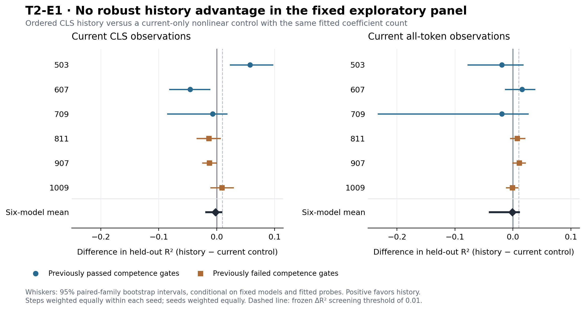

# T2-E1 — Does CLS history improve prediction beyond current observations?

**Research lead:** Saim 13.02  
**Completed:** 11 September 2026  
**Status:** Complete; the frozen exploratory success criterion was not met.

This study directly tested incremental prediction of remaining loss reduction on all six frozen U7C models. Ordered CLS history did not provide a robust advantage over the current-only nonlinear control with the same fitted coefficient count. The primary all-token comparison had mean ΔR² = −0.000884, with a conditional 95% bootstrap interval [−0.039843, +0.010258]. Mean absolute error was worse with history by 0.001185 nats.

An apparent mean improvement over the simplest CLS-only linear predictor was not retained against the nonlinear current-only control. This makes baseline choice an empirical concern. It does not establish that baseline flexibility is the sole mechanism behind every apparent history gain.

## Why this study is a new exploratory branch

The user requested the next study after the matched-example audit. T2-E1 separately freezes an observational scope using all six exposed U7C checkpoints. It does not change U7C’s failed competence gate or advance T1-U8. Seeds 503/607/709 previously passed competence gates; 811/907/1009 failed. All six remain in this study and its primary average. No model was retrained, and reserved model seeds 1103/1201/1301 remain unopened.

These are auxiliary-supervised, development-exposed models. This is not confirmation on an untouched population of reliably competent Transformers. The original T1 negative results remain part of the evidence.

## Frozen question, target, and observations

The primary target is V_l = NLL_l − NLL_6, using the true label and probabilities clipped to [1e−8, 1]. Negative values are retained. Labels and final outputs construct the training/evaluation target only; they never enter predictor inputs. Decision-flip prevalence is reported separately as a diagnostic. No binary decision-stability probe was fitted.

| View | Current input | History added |
|---|---|---|
| CLS | 32 CLS residual values + two probabilities + entropy + margin: 36 columns | The same 36 CLS observables from steps 1 through l−1 |
| All tokens | 12 × 32 residual values in fixed token-position order + the same four prediction summaries: 388 columns | The same CLS history; full-token history is not tested |

All-token observations are a richer current view. They are not a claim of matched computational cost with the CLS view. The history candidate always retains the identical current-input prefix used by its corresponding baseline. Attention features are absent; no attention-specific mechanism claim is made.

## Data, partitions, and eligibility

- Six fixed model seeds; 3,000 fresh counterfactual families per seed, with two examples per family: 36,000 examples in total.
- Per seed: 1,600 training families (3,200 examples), 400 validation families (800 examples), and 1,000 test families (2,000 examples).
- All steps and both counterfactual members of a family share a partition. Duplicate families across partitions and exact family matches to model training/validation streams or previously exposed clean/causal suites are excluded.
- Equivalent rearrangements of mapping positions are not excluded. This is exact-example family separation, not a test of compositional or permutation generalization.
- Steps 2, 3, 4, and 5 are all reported. A step enters the primary aggregate only if its probe-training target has both mean and sample SD at least 0.02 nats. Eligibility does not use validation/test gains.
- Fourteen of 24 seed-step cells were eligible, and all six seeds contribute at least one step.

| Seed | Training-eligible steps | Final accuracy on fresh test pairs’ members |
|---:|---|---:|
| 503 | 2, 3, 4 | 99.20% |
| 607 | 2 | 99.70% |
| 709 | 2, 3 | 99.90% |
| 811 | 2, 3, 4 | 71.95% |
| 907 | 2, 3, 4 | 73.50% |
| 1009 | 2, 3 | 69.55% |

## Fixed probes and controls

Each probe is linear ridge regression with an intercept. The fixed alpha grid is {0.01, 0.1, 1, 10, 100}; validation MSE selects one value, with ties choosing the larger alpha. There is no train-plus-validation refit. Final feature standardization uses training means and population SDs only. Every arm has the same training/validation examples and five-value alpha budget.

| Arm | Purpose |
|---|---|
| Current linear | Simple current-only reference |
| Current dimension control | Current plus fixed linear projections; matches history’s fitted coefficient count |
| Current nonlinear control | Current plus fixed cosine random Fourier features; same fitted coefficient count as history |
| Ordered history | Current plus chronological CLS past |
| Shuffled history | Current fixed; per-family past-step order permuted |
| Sample-mismatched history | Current fixed; past supplied by another family within the same partition |
| Residualized history | Current plus past residuals after a train-only current-to-past ridge fit |

For the CLS view, matched arms have 73/109/145/181 fitted coefficients including intercept at steps 2/3/4/5; the simple reference has 37. For the all-token view, matched arms have 425/461/497/533 coefficients; the simple reference has 389. Equal fitted coefficient count does not establish equal effective capacity, fixed-transform size, or inference cost.

At step 2 there is only one past step; shuffled history is an exact alias and supplies no chronology test. Its duplicate results are labeled. The panel has 336 reported cells but 324 distinct ridge fits and 1,620 alpha candidates.

## Primary and supporting comparisons

Positive ΔR² means history predicts better. Positive MAE advantage means history has lower absolute error. Each seed receives equal weight after averaging its training-eligible steps.

| Current view | Comparator | Mean ΔR² | Conditional 95% interval | Mean MAE advantage (nats) | Seeds with positive ΔR² |
|---|---|---:|---|---:|---:|
| CLS current view | Simple linear | +0.015940 | [-0.012207, +0.028721] | -0.001236 | 5/6 |
| CLS current view | Matched nonlinear | -0.001985 | [-0.018192, +0.008131] | -0.000989 | 2/6 |
| All-token current view | Simple linear | +0.003410 | [-0.039299, +0.014614] | -0.002588 | 4/6 |
| All-token current view | Matched nonlinear | -0.000884 | [-0.039843, +0.010258] | -0.001185 | 3/6 |

The primary comparison is all-token current plus CLS history versus the matched nonlinear all-token current-only control. The simple all-token current-only reference is a necessary additional check. Both fail the frozen screen.

The screen required mean ΔR² ≥0.01, a conditional bootstrap lower bound above zero, a positive effect in each of six seeds, and nonnegative mean MAE advantage. The 0.01 threshold is a fixed exploratory screening convention, not an established controller-utility threshold. The primary interval includes both zero and +0.01, so this study does not establish equivalence or rule out every practically useful effect.

### Absolute predictive performance

| Current view | Simple current R² | Matched nonlinear current R² | Ordered-history R² |
|---|---:|---:|---:|
| CLS current view | 0.099631 | 0.117556 | 0.115570 |
| All-token current view | 0.132676 | 0.136970 | 0.136086 |

These are equal-seed means of within-seed eligible-step scores, not R² calculated on a pooled dataset. Overall predictive strength remains limited; no controller performance was evaluated.

### Per-seed effects against the matched nonlinear control

| Seed | CLS-view ΔR² | All-token-view ΔR² |
|---:|---:|---:|
| 503 | +0.057519 | -0.019010 |
| 607 | -0.045669 | +0.015687 |
| 709 | -0.006932 | -0.019085 |
| 811 | -0.013386 | +0.007209 |
| 907 | -0.012586 | +0.010994 |
| 1009 | +0.009142 | -0.001100 |

## What the controls show

Against shuffled history on chronology-eligible steps, ordered history has mean ΔR² +0.008745 for the CLS view, interval [−0.030659, +0.022776], and −0.011049 for the all-token view, interval [−0.099312, +0.008237]. Only five seeds contribute because seed 607 has no eligible step with two past slots. Neither supports a reliable chronological-order advantage.

Against sample-mismatched history, mean effects are +0.023098 (CLS) and +0.010923 (all tokens), but both conditional intervals include zero. Residualization and dimension matching also do not produce a consistent panel-wide history advantage. All control results remain in the saved metrics and comparison files. These secondary comparisons are descriptive and are not multiple-testing-adjusted discoveries.

## Uncertainty and interpretation limits

The 95% intervals use 1,000 paired bootstrap resamples of the 1,000 test families within each seed. Each resample retains both pair members and uses the same draws across steps and arms. The six model seeds and trained probes are held fixed. These intervals describe held-out-example uncertainty conditional on that fixed setup; they do not cover fresh model initialization, retraining, training-set variation, hyperparameter selection variability, or the general population of Transformers. Steps are not counted as independent model replicates.

The evidence concerns CLS history under two current-observation choices, a particular auxiliary-supervised training recipe, a two-hop task, and ridge probes with specified fixed features. It does not establish that the full current state is universally sufficient, that all useful history has been tested, or that metacognitive computation is absent. No claim about decision-stability advantage, attention-specific mechanisms, causal self-monitoring, or adaptive-computation savings follows.

## Verification

- Frozen protocol, source files, and six checkpoint hashes were checked before and after execution.
- Six method checks validated the ridge path against scikit-learn on collinear synthetic inputs, test-label isolation, train-only normalization, temporal permutation, future-state exclusion from past controls, and counterfactual family grouping.
- All 336 held-out metric rows were independently recomputed from the saved predictions using scikit-learn metrics. Seed-level and panel-level point aggregation were verified without refitting.
- Exact family overlap with excluded data and cross-partition family overlap were zero for every seed.
- One fixed study run completed in 50.78 seconds in the recorded CPU environment. No outcome-driven parameter expansion or study rerun occurred. Method-check fitting was synthetic and separate from the 324 research probe fits.

## Decision and next boundary

Close T2-E1 with a negative/inconclusive history-advantage result under its frozen exploratory criteria. Keep the original T1 negative evidence and U7 competence failures. Do not tune this exposed test panel to obtain a positive result. No confirmation advancement is authorized by these results.

The useful methodological finding is that a comparison against a simple CLS linear baseline can give a more favorable impression than a comparison against a matched nonlinear current-only baseline. A later study should justify a new model/task regime and a concrete predictive-use threshold before new data or fitting. This result provides no basis yet for claiming that a history-based controller will improve decisions or save computation.

## Reproduction and sources

Open `T2_E1_Observer_Study_Colab.ipynb` in Colab and upload `T2_E1_Observer_Study.zip`. The notebook verifies package integrity, checks the methods, and writes a new reproduction directory. The bundle includes original source, six checkpoints, exact protocol, generated examples and labels, test predictions, full metrics, validation choices, figure code, and verification records. Intermediate full-state tensors are regenerated from frozen checkpoints to keep the bundle small.

- [Original T1 report](https://drive.google.com/file/d/1e4x-TVQxDMjAx9nAn1KOUTyh2hKpwdnc/view).
- [Completed U7C report](https://drive.google.com/file/d/1k-ZR3KaprlnSEiOXjXSFEibPdRwKlaTl/view).
- [Matched U7B/U7C audit](https://drive.google.com/file/d/1q4ALgMG3ZvX3MI-4y4Ki68ADrOicNNWU/view).
- `STUDY_PROTOCOL.json`, `FROZEN_INPUT_SHA256.json`, `results/study_result.json`, `results/data_checks.json`, and `results/result_verification.json` document the new study.
